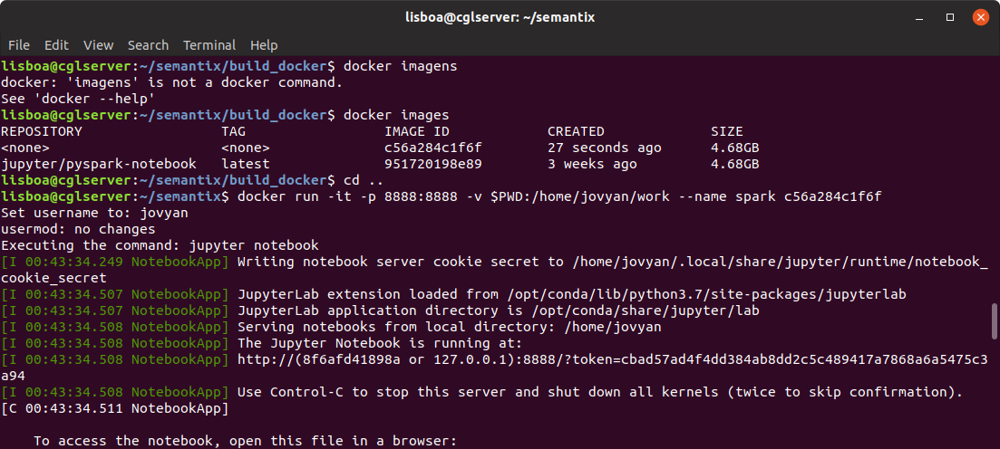

# BIGDATA ETL 

##  Arquitetura BIGDATA Tecnologias 

 - APACHE SPARK 2.3.x
 - ETL - Projeto PYSPARK 2.3.x
 - ETL - JUPYTER NOTEBOOK
 - DOCKER 
 - HIVE

 
## Engenheiro de Dados ETL 

Abril 2019

### Caso HTTP​ ​ requests​ ​ to​ ​ the​ ​ NASA​ ​ Kennedy​ ​ Space​ ​ Center​ ​ WWW​ ​ server

Fonte​ ​ oficial​ ​ do​ ​ dateset​ : [NASA](​http://ita.ee.lbl.gov/html/contrib/NASA-HTTP.html)​

Dados:

- Jul​ ​ 01​ ​ to​ ​ Jul​ ​ 31,​ ​ ASCII​ ​ format,​ ​ 20.7​ ​ MB​ ​ gzip​ ​ compressed​ , ​ ​ 205.2​ ​ MB. [ftp](ftp://ita.ee.lbl.gov/traces/NASA_access_log_Jul95.gz)
- Aug​ ​ 04​ ​ to​ ​ Aug​ ​ 31,​ ​ ASCII​ ​ format,​ ​ 21.8​ ​ MB​ ​ gzip​ ​ compressed​ , ​ ​ 167.8​ ​ MB. [ftp](ftp://ita.ee.lbl.gov/traces/NASA_access_log_Aug95.gz)


#### Geracao dos MOCKS para processamento

O arquivos acima deverão estar descompactados na pasta:  etl_pyspark/dados/mock/nasa

O processo irá fazer a leitura de todos os arquivos que estão no mesmo padrão dentro da pasta indicada acima.


####Sobre o dataset​ : 
Esses dois conjuntos de dados possuem todas as requisições HTTP para o servidor da NASA Kennedy
Space​ ​ Center​ ​ WWW​ ​ na​ ​ Flórida​ ​ para​ ​ um​ ​ período​ ​ específico.

Os​ ​ logs​ ​ estão​ ​ em​ ​ arquivos​ ​ ASCII​ ​ com​ ​ uma​ ​ linha​ ​ por​ ​ requisição​ ​ com​ ​ as​ ​ seguintes​ ​ colunas:

- Host fazendo a requisição​ . Um hostname quando possível, caso contrário o endereço de internet se o nome
não​ ​ puder​ ​ ser​ ​ identificado.
- Timestamp​ ​ no​ ​ formato​ ​ "DIA/MÊS/ANO:HH:MM:SS​ ​ TIMEZONE"
- Requisição​ ​ (entre​ ​ aspas)
- Código​ ​ do​ ​ retorno​ ​ HTTP
- Total​ ​ de​ ​ bytes​ ​ retornados

###Questões

Responda​ ​ as​ ​ seguintes​ ​ questões​ ​ devem​ ​ ser​ ​ desenvolvidas​ ​ em​ ​ Spark​ ​ utilizando​ ​ a ​ ​ sua​ ​ linguagem​ ​ de​ ​ preferência.

1. Número​ ​ de​ ​ hosts​ ​ únicos.
2. O​ ​ total​ ​ de​ ​ erros​ ​ 404.
3. Os​ ​ 5 ​ ​ URLs​ ​ que​ ​ mais​ ​ causaram​ ​ erro​ ​ 404.
4. Quantidade​ ​ de​ ​ erros​ ​ 404​ ​ por​ ​ dia.
5. O​ ​ total​ ​ de​ ​ bytes​ ​ retornados.
 
 
### Repositório GIT

Acessar o diretório de projetos e clonar o repositório do [GIT](https://github.com/cglsoft/) na pasta sm_desafio.

Passos para instalação:

```sh
$ git clone git clone https://github.com/cglsoft/sm_desafio.git
$ cd sm_desafio
```

### Deploy DOCKER Container PYSPARK/JUPYTER NOTEBOOK

Para rodar a solução o primeiro passo será fazer build do container Docker localizado na pasta sm_desafio/build_docker.

Acessar o diretório build_docker para e executar o script abaixo para a criação da imagem:

```sh
$ cd build_docker
$ docker build -t jupyter_notebook:v1 .
```

#####Referências: Container Docker HUB o repositório do [HUB](https://hub.docker.com/).

Após a criação do container, executar o comando abaixo para identificar o IMAGE_ID que será a referência para a execução do container.

```sh
$ docker images
```


De posse do IMAGE_ID da imagem criada, executar os comandos abaixo subir o container e validação da solução:

####Atenção: Voltar para o diretório do projeto!


```sh
$ cd ..
$ docker run -it -p 8888:8888 -v $PWD:/home/jovyan/work --name spark 2bd4d02727b8 
```

Apos o deploy do serviço será fornecido o TOKEN que deverá ser copiado conforme tela abaixo:

[](http://127.0.0.1:8888)


No navegador de sua preferência, acessar o endereço do Jupyter Notebook: [Jupyter Notebook](http://127.0.0.1:8888).

```sh
127.0.0.1:8888
```


### Respostas - JUPYTER NOTEBOOK

Para visualizar as respostas acessar o arquivo : [jupyter_notebook](https://github.com/cglsoft/sm_desafio/blob/master/SM%20Desafio.ipynb) 
 
 
### Respostas - INGESTÃO PYSPARK -> SPARK SUBMIT YARN

Para execução do projeto utilizar a pasta : [spark-submit](https://github.com/cglsoft/sm_desafio/tree/master/etl_pyspark)
 


# Projeto ETL - SPARK-SUBMIT  

O projeto disponibilizado faz toda a funcionalidade do JUPYTER NOTEBOOK conforme demonstrado acima, agora com o plus de execução em cluster.

Na pasta [] é possível explorar todo o código ETL para carga das informações:

Veja [ETL Carga Datalake](https://github.com/cglsoft/sm_desafio)


FIM